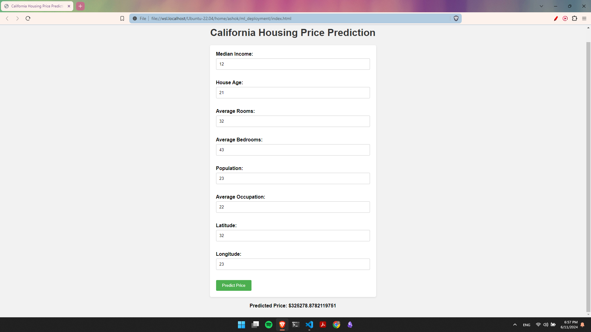

# Deploying Your Machine Learning Model Using FastAPI and Docker




Certainly! Here's a short README with usage instructions for the California Housing Price Prediction application:

---

### California Housing Price Prediction

This application predicts the median house price in California districts based on various housing features using an XGBoost regression model.

## Usage

### Installation

1. Clone the repository:

   ```bash
   git clone git@github.com:thenaivekid/Deploy-ML-Project.git
   ```

2. Navigate to the project directory:

   ```bash
   cd Deploy-ML-Project
   ```

3. Build the Docker image:

   ```bash
   docker build -t california-housing-prediction .
   ```

### Running the Application

4. Run the Docker container:

   ```bash
   docker run -p 80:80 california-housing-prediction
   ```

5. Open index.html in your web browser or access through api http://127.0.0.1:8000/predict

6. Fill out the form with the following housing features:
   - Median Income (MedInc)
   - House Age (HouseAge)
   - Average Rooms (AveRooms)
   - Average Bedrooms (AveBedrms)
   - Population (Population)
   - Average Occupation (AveOccup)
   - Latitude (Latitude)
   - Longitude (Longitude)

7. Click the "Predict Price" button to see the predicted median house price for the given features.

## Contributors

- [Ashok Neupane](https://github.com/thenaivekid)

---

Feel free to update the contributors section with your information and customize the README further as needed!